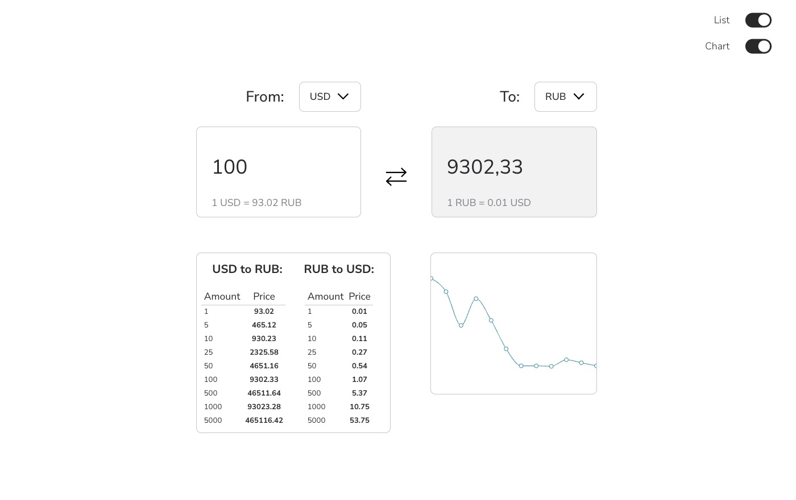

# Конвертер Валют

## Описание Задания

Создать интерфейс приложения конвертера валют с загрузкой актуальных данных по API, возможностью просмотра истории курсов валют и простой настройкой интерфейса.

## Установка и Запуск

1. Установите зависимости: `npm install`
2. Запустите приложение: `npm start`

## Пример

## Демо

https://react-currency-converter-omega.vercel.app/

## Технологии

- React
- TypeScript
- Effector.js
- CSS Modules

## Решение и Особенности

- Для получения актуальных данных о валютах был использован сервис https://app.freecurrencyapi.com/
- Интерфейс приложения адаптирован под мобильные устройства.
- Для отображения графика используется библиотека Recharts
